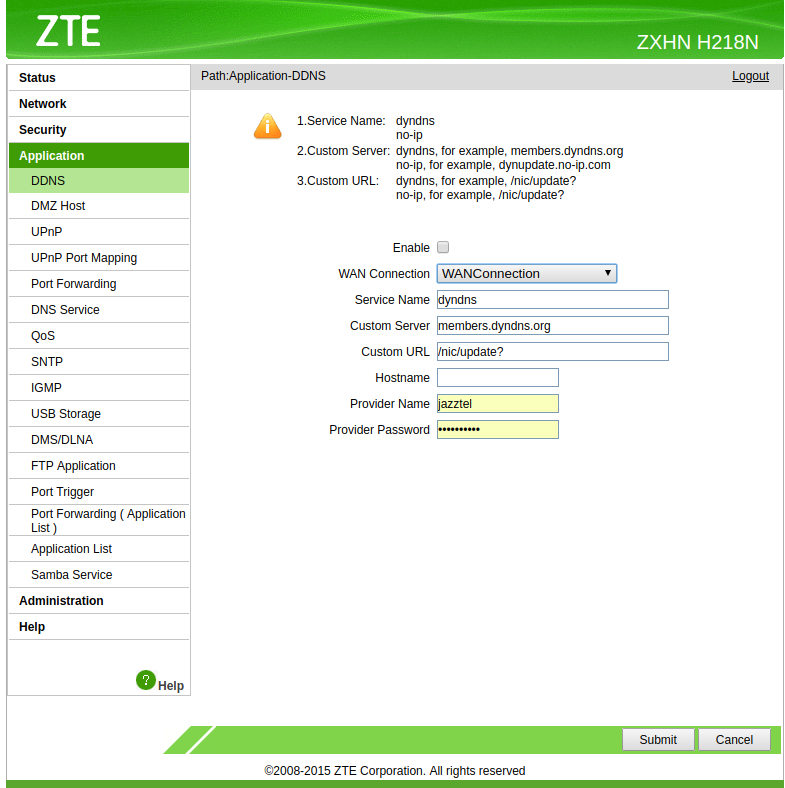
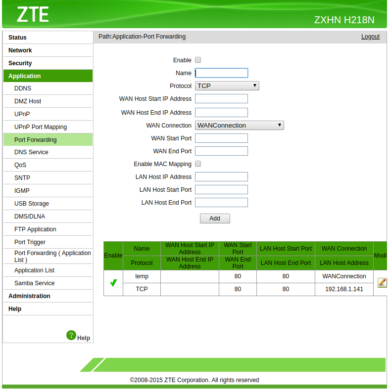

# Hosting
  * Dominio
  * Alojamiento
    * Servidor
    * Almacenamiento
    * Lenguajes de programación
    * Base de datos
    * CMS: wordpress, drupal, moodle, ....
## DNS Dinámico

Mantener una IP dinámica accesible mediante un nombre

Debemos usar un proveedor que nos permita hacer esto. Gratuitos no-ip.com o dyndns

    
# Páginas Webs
  * Estáticas ([HTML](./HTML.md))
  * Dinámicas
    * HTML5 + javascript
    * PHP
    * Java
    * ASP
    
    
# Accesibilidad desde el exterior

