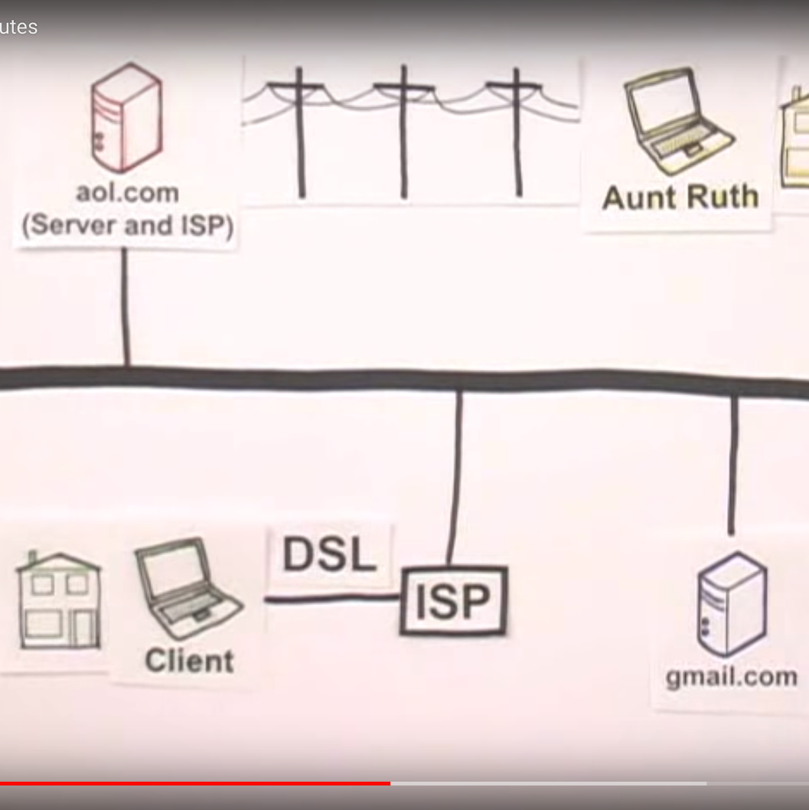
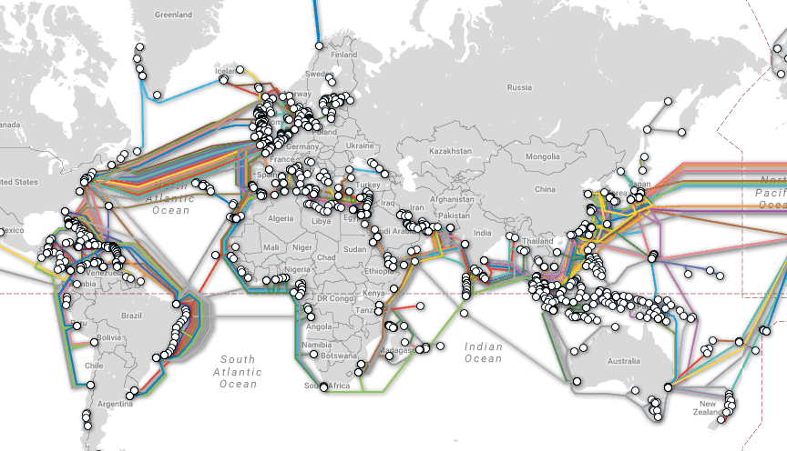

# Internet

[Video: How Internet works](https://www.youtube.com/watch?v=7_LPdttKXPc)

[The internet map](https://internet-map.net/)

[Mapas de internet]

## DNSs

Es el servicio que permite encontrar los servidores de internet, traduciendo su nombre en la correspondiente IP

### Herramienta [nslookup](https://www.lifewire.com/what-is-nslookup-817516)

Nos permite indagar en los servicios de nombres

        nslookup lifewire.com
        
Podemos usarla para ver c'omo se resuelven los servicios de correo

    nslookup
    > set Type=mx
    lifewire.com
    ......

### Herramienta [Ping](https://www.lifewire.com/ping-command-2618099)

    ping servidor

        ping -n 5 -l 1500 www.google.com
        
        
        

## Arquitectura

### Traceroute

(En windows)

        tracert servidor

(En linux)
        traceroute servidor
        
        

        
  *  Herramientas de hacking
### Backbones, y arquitectura de Internet

* Servidores va servicios
* Ejemplo: cómo funciona Google o Facebook
