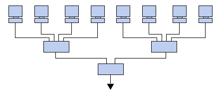

# Redes

##  IPs, Redes y subredes

Cualquier máquina que quiera establecer una conexión a través de Internet  o en una red local debe de tener una dirección IP, que no es más que un identificador inequívoco de la máquina  en la red.

### [IPv4](https://es.wikipedia.org/wiki/IPv4)

Está formado por 4 números que pueden estar comprendido entre 0 y 255, 32 bits que permiten 4.294.967.296 direcciones distintas

Los primeros 3 números identifican la red y el último al ordenador dentro de ésta

Podemos pensar que la red de la izquierda es la 192.168.1.x y la de la derecha 192.168.0.x

Así los ordenadore de cada una serían....

Algunos números se reservan como el 0, el 1 y el 255

### [IPv6](https://es.wikipedia.org/wiki/IPv6)

En la actualidad se está inplantando el protocolo IPv6 capaz de trabajar con 128 bits lo que permite direccionar 340.282.366.920.938.463.463.374.607.431.768.211.456 direcciones

[Test your IPv6](https://test-ipv6.com/)

Las direcciones de red pueden ser:
* Estáticas: se mantienen en el tiempo
* Dinámicas: cambian de vez en cuando

### Conociendo nuesta red

* En windows: ipconfig

* En Linux: ifconfig

###  Detección de dispositivos en una red, herramientas

Para ver los equipos que hay conectados a una red

(En linux)

        nmap -sP 192.168.1.*

(En Windows)

[http://www.advanced-ip-scanner.com/es/](http://www.advanced-ip-scanner.com/es/)

En todo momento podemos ver las conexiones que tiene nuestro equipo con el resto usando

        netstat -nt

## Tipos de Dispositivos
  * HUB
  * Switch/Bridge
  * Router
  * AP
  
[Diferencias](https://www.xataka.com/basics/cuales-son-las-diferencias-entre-hub-switch-y-routers)
## Configuración de routers
  * NAT
  * DMZ
  

    

